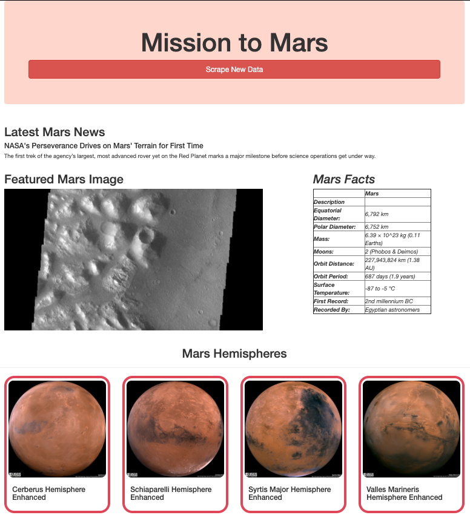

# Mission to Mars

## Overview of Project
This project will automate a web browser to extract or scrape data about the Mission to Mars. The automated scrape will be completed using BeautifulSoup and Splinter. The information extracted will be stored in a MongoDB database and displayed using a Flask web application. 

## Summary
In all, the completed web application displays various information related to Mars and the Mission to Mars. To start, the scrape will present the most recent news update from the NASA Mars News website and the summary of the article, displayed in the “Latest Mars News” section. Next, the web app will display the featured image from the Jet Propulsion Laboratory’s Space Images webpage. To provide better usability, the web application also scrapes and displays data/ facts about Mars. Lastly, full-resolution images from Mars’ hemispheres with titles were scraped and added to the web application.

Various customizations were done to improve the visual presentation of the web application:

*Figure 1 – Mission to Mars Web App*

